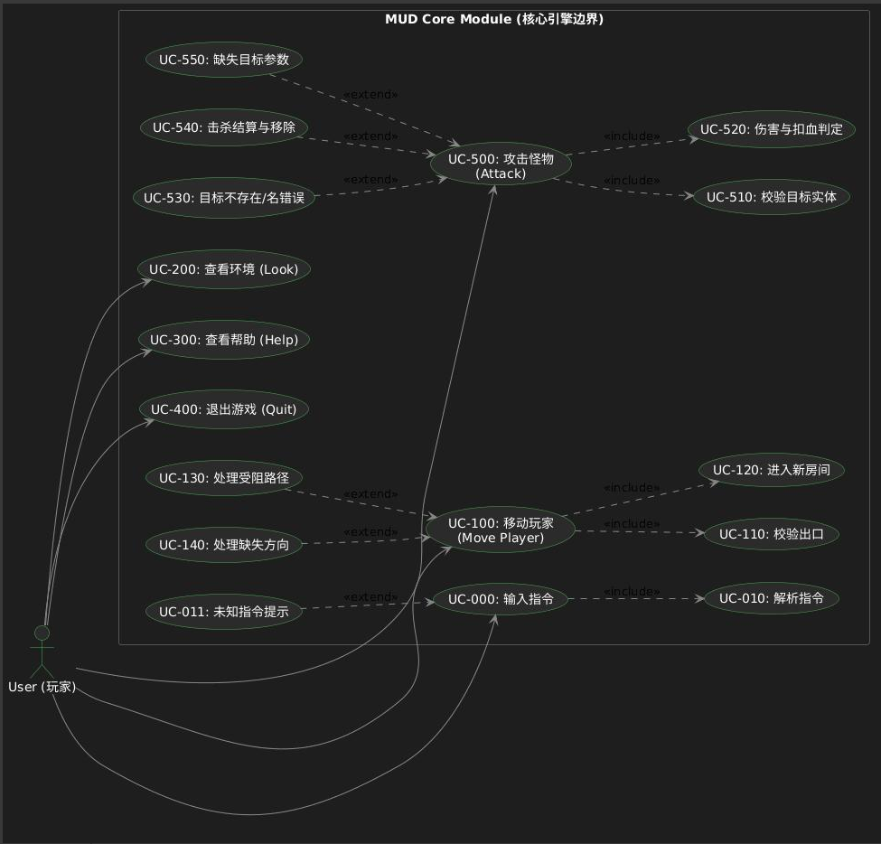
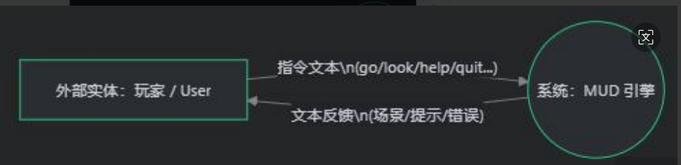
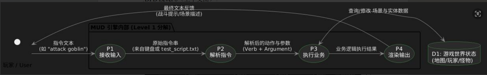

# Mud泥巴游戏 需求规格说明书（更新版）
## 修订记录
| 版本 | 时间 | 更新内容 |
|------|------|----------|
| V2.0 | 2026-04-08 | 新增核心业务用例图、DFD数据流图 |

## 1. 泥巴游戏核心业务用例图
### 1.1 用例说明
覆盖玩家核心行为：登录游戏、角色创建、指令操作（移动/攻击/背包）、场景切换、战斗交互。
### 1.2 用例图

## 2. 泥巴游戏DFD数据流图
### 2.1 0级DFD（顶层）
描述玩家、游戏核心、场景/怪物/背包数据的交互。

### 2.2 1级DFD（核心流程拆解）
拆解「指令解析→状态校验→业务执行→数据返回」全流程数据流。

### 2.3 核心数据流说明
| 数据流 | 来源 | 去向 | 数据内容 |
|--------|------|------|----------|
| 玩家指令 | 玩家端 | 指令解析模块 | 指令类型(move/attack)、参数、角色ID |
| 状态请求 | 指令模块 | 状态机模块 | 角色ID、目标状态 |
| 战斗请求 | 指令模块 | 战斗模块 | 玩家ID、怪物ID、场景ID |
| 背包数据 | 背包模块 | 玩家端 | 物品ID、物品名称、数量、属性 |
| 怪物数据 | 怪物工厂 | 场景模块 | 怪物ID、名称、血量、攻击 |